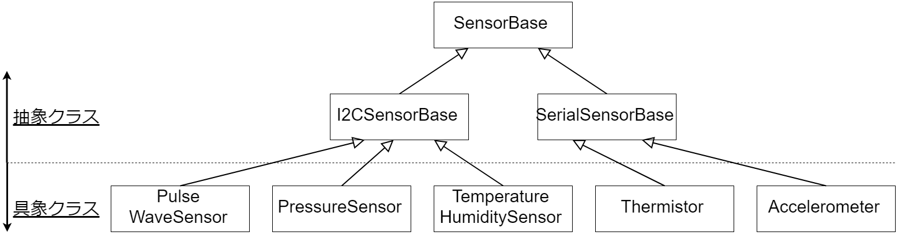

# MQTT-I2C-sensing
Raspberry Pi 3B+で複数個のセンサーからセンシングをし、MQTTを使ってPublishします。

# センサーについて
## 概要
| ラズパイで読んでいるセンサー | Arduinoで読んでいるセンサー     |
| :-------------: | :-------------: |
| 温湿度センサー(SHT31)       | サーミスター(103JT-050)       |
|気圧センサー(LPS251B)   |加速度センサー(KX224-1053)   |
|脈波センサー(BH1792GLC)   |   |

1. Arduinoで読んでいるセンサーについては、Arduino側で値の処理などをしてからシリアル通信でラズパイに送っています。
2. Arduino側には温湿度センサーがついていますが、読んでいません(プルアップ抵抗代わりに入れています)

## 構成図


## クラス図
### センサーを表すクラス

### センサーを統括するクラスとセンサーを表すクラスの関係

---

# 開発の方針
基本的にはissue駆動開発とし、
1. タスクに対してissueを立てる
2. 自分が担当する場合issueのassignerに自分を選択
2. それに対応させた名前のブランチを切る
3. PRを送る(mergeする際はmasterのコミットログが見やすいようにSquash and merge)

のような流れで進めていきたいと思います

---

# 採用しているコーディング規約など
基本的に命名などについては**PEP8**、docstringは**numpyスタイル**で書いていますが、細部までこだわっているわけではないので何かあったらご連絡ください

---

# ラズパイ側の設定
ラズパイ側でしている(明記しておいた方がいいと考えられる)設定について以下に書いておきます

## alias
開発の便利のためにaliasを設定しています。不都合が生じた場合は`.bashrc`を変更してください
|alias|元コマンド|概説|
|:-|:-|:-|
|python|python3|python2系で実行するのを防ぐためです|
|pip   |pip3   |python2系で実行するのを防ぐためです|
|gb    |git branch   |よく使うgitコマンドです     |
|gck   |git checkout  |よく使うgitコマンドです   |
|gp   |git pull   |よく使うgitコマンドです   |
|gcm   |git commit -a -m  |よく使うgitコマンドです   |
|i2c   |i2cdetect -y 1   |I2Cのアドレスの確認です   |

## 開発環境
仮想環境の構築に **pipenv** を利用しています。  
依存関係などを見たい場合には、`mqtt-i2c-sensing`のディレクトリに入ったうえで
```bash
pipenv run pip check
```
を実行してください。

## 実行環境について
Pipfileに`RPi.GPIO`が書けないので、インストール用のファイルは`requirements.txt`に書き出しておきました。ラズパイにはすでにインストール済みです

## 再起動時の自動実行について
cronで実行しています
```bash
crontab -e
```
で確認できます

---

# メモ
|日付|概要|メモ|
|:-:|:-:|:-:|
|3/14|リポジトリ開設、開発開始|ラズパイ、センサー等の発注をしていていただいた、到着次第メイン開発を開始するが、それまでできることをやっておく(MQTTなど)|
|3/17|ラズパイ到着|セットアップをしてタスク1を終了させた|
|3/18|タスク2.5の挿入と納期延長|アナログ入力のモジュールが追加されたのでそのタスクが2.5になった。納期が3日くらい延びた|
|3/19|センサ到着|はんだごてがないので追加でとどけてもらうことになった|
|3/19|センサが増えた|センサが増えた|
|3/25   |開発合宿開始とはんだごて到着   |   |
|3/27   |開発合宿終了とシールド到着   |   |
|3/28   |全タスク終了   |   |
